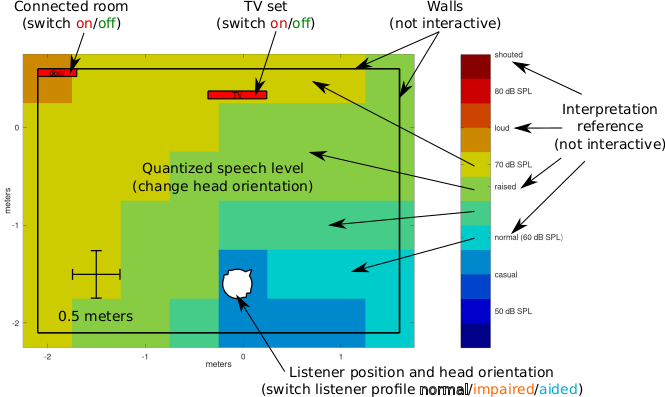

# Speech recognition performance simulation toolchain with FADE, TASCAR, and openMHA
This expert-software can be used to simulate speech recognition experiments in complex acoustic scenes.

This repository holds most of the necessary files to understand and reproduce the experiment *"Interactive spatial speech recognition maps based on simulated speech recognition experiments".

Author: Marc René Schädler (2021)

E-mail: marc.rene.schaedler@uni-oldenburg.de

The toolchain provided in this software package was used to simulate aided speech recognition experiments with the Framework for Auditory Discrimination Experiments (FADE, [1]) in acoustic scenes that were rendered with the Toolbox for Acoustic Scene Creation and Rendering (TASCAR, [2]) where the hearing aid was simulated with the open Master Hearing Aid (openMHA, [3]).

The simulation results can be explored using interactive spatial speech recognition map.
An screenshot with an explanation is shown in the image above.
The implementation of the GUI as well as data from the demonstration example can be found in `maps/play_demonstrator.m`.

# Usage
This is a collection of scripts that was used for studying the aided speech recognition performance of listeners with impaired hearing in acoustically complex listening conditions.

'''There is no guarantee that these scripts work, nor that their output will help you in any way.'''

We offer this example as a reference or starting point for colleagues who want to better understand our work.
If you don't know the tools FADE, TASCAR, or openMHA it is very likely that the provided code won't immediately help.
The scripts were developed and used on Ubuntu Linux 20.10.
They require a functional installation of the following programs:

1. A working installation of [FADE](https://github.com/m-r-s/fade). Follow the instructions on the project website.
2. A working installation of [TASCAR](https://github.com/HoerTech-gGmbH/tascar). Follow the instructions on the project website.
3. A working installation of [openMHA](https://github.com/HoerTech-gGmbH/openMHA). Follow the instructions on the project website.
4. At least the following additional packages (let me know if I missed some): build-essential gawk octave octave-signal liboctave-dev sox git

Due to licensing issues, the matrix sentence speech material, which needs to be placed in `matrix/speech/`, and the scene description, which needs to be given in `scene-livingroom/environment.tsc`, cannot be provided in this repository.

With a completed configuration, the script "run_experiment.sh" runs a set of simulations with the exemplary acoustic scene defined in "scene-livingroom" using the hearing aid configured in the "processing-openMHA" folder and plots the outcomes as a maps.

# References
[1] Schädler, M. R., Warzybok, A., Ewert, S. D., Kollmeier, B. (2016) "A simulation framework for auditory discrimination experiments: Revealing the importance of across-frequency processing in speech perception", Journal of the Acoustical Society of America, Volume 139, Issue 5, pp. 2708–2723, URL: http://link.aip.org/link/?JAS/139/2708

[2] Grimm, G., Luberadzka, J., Herzke, T., Hohmann, V. (2015) "Toolbox for acoustic scene creation and rendering (TASCAR) - Render methods and research applications", in Proceedings of the Linux Audio Conference, Mainz, 2015

[3] Herzke, T., Kayser, H., Loshaj, F., Grimm, G., Hohmann, V. "Open signal processing software platform for hearing aid research (openMHA)", in Proceedings of the Linux Audio Conference. Université Jean Monnet, Saint-Étienne, pp. 35-42, 2017.
